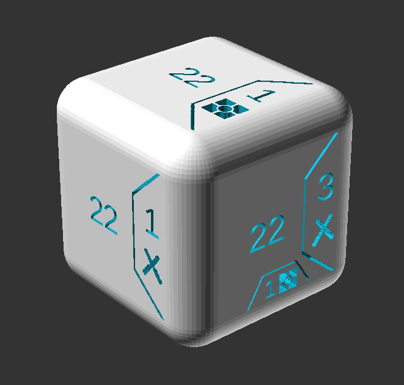

# Star Wars: Destiny - Proxy Dice Creator



I enjoy playing Star Wars: Destiny and decided to create a simple method I could
use to 3D print proxy dice. I wanted to be able to test out how certain cards
played with multiple dice without needed to purchase another. This way if I
enjoyed it, I could then go out and grab the cards I really wanted.

## Usage

You will need to install openscad from [here](http://www.openscad.org/downloads.html).

Once it is installed, you can open the `.scad` file in the repository. There are
two things you will need to fill out.

The first is `DIE_NUMBER`. This iss the number or unique identifier of the die you are printing. You
should probably only insert 3 characters tops. I normally use the card number
of the die.

The second is `FACES`. Each list element relates to a particular face of the die.
All list items are strings and the order is as follows:

```
["face type", "face value", "cost type", "cost value"]

valid types: blank, special, melee, ranged, indirect, shield, resource, disrupt,
             discard, focus
```

If you dont understand what i mean, just render the example Tusken Raider die
and play around with the values. 

Once you have the die exactly as you want it, you can easily export it as an STL
and then it is ready to be printed on your favorite 3D printer! I have multiple
die printed on my Creality Ender 3 and it works great!

Have fun!

## License

Copyright © 2018 Alexander Maricich

Distributed under the Eclipse Public License version 1.0.
